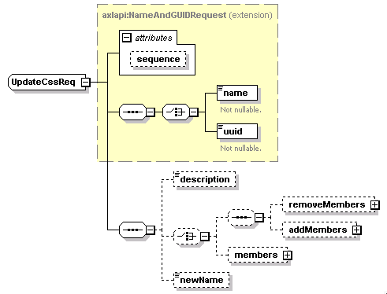

# axl-php-samples

## Overview

A set of small sample scripts demonstrating how to use the CUCM AXL APIs for reading and configuring system objects and elements.  The samples output HTML using PHP and the SoapClient and DOMDocument libraries.

[https://developer.cisco.com/site/axl/](https://developer.cisco.com/site/axl/)

## Available samples

* `add_update_Css.php` - AXL `<addCss>` sample script to add a Calling Search Space, then
update it using an `<addMembers>` list ( `<addRoutePartition>`, `<addCss>`, `<updateCss>` )

## Getting started

Tested on: Ubuntu 19.10 / Apache2 / PHP 7.3

* Install Apache2:

    ```shell
    sudo apt install apache2
    ```

* Install PHP:

    ```shell
    sudo apt install php libapache2-mod-php

* Install PHP SOAP
    
    ```shell
    sudo apt install php-soap
    ```

* Install DOMDocument:

    ```shell
    sudo apt install php-xml
    ```

* Re-start Apache2 to enable all the new modules:

    ```shell
    sudo systemctl restart apache2

* Clone this repo:

    ```shell
    git clone https://github.com/CiscoDevNet/axl-php-samples.git
    
    cd axl-php-samples
    ```

* Install the Composer PHP package manager ([see instructions](https://getcomposer.org/doc/00-intro.md#installation-linux-unix-macos))

* Install PHP dependencies:

    ```shell
    composer install
    ```

* The AXL v12.5 WSDL files are included in this project.  If you'd like to use a different version, replace with the AXL WSDL files for your CUCM version:

    1. From the CUCM Administration UI, download the 'Cisco AXL Tookit' from **Applications** / **Plugins**

    1. Unzip the kit, and navigate to the `schema/current` folder

    1. Copy the three WSDL files to the `schema/` directory of this project: `AXLAPI.wsdl`, `AXLEnums.xsd`, `AXLSoap.xsd`

* The project was built/tested using [Visual Studio Code](https://code.visualstudio.com/).  Open the project folder in VS Code:

    ```shell
    code .
    ```
  
* In VS Code:

    * Install the 'PHP Extension Pack' extension (felixfbecker.php-pack) to enable highlighting and intellisense

    * Copy `.env.example` to `.env`, then edit `.env` to specify your CUCM host name/IP and API user credentials

* Copy the following files/folders  to your PHP CGI root:

    * `.php`
    * `.env`
    * `schema/`
    * `vendor/`

        E.g. for Apache2 on Ubuntu 19.10: 

        ```shell
        sudo mkdir /var/www/html/axl-php-samples/
        
        sudo cp -r {*.php,.env,vendor/,schema/} /var/www/html/axl-php-samples/
        ```
* Finally, open the URL corresponding to the desired sample in your browser, e.g.: http://localhost/axl-php-samples/add_update_Css.php

## Hints

* **HTTPS certificate checking** For production, see the comments in each sample script file to enable HTTPS certificate authority validity and name checking.  You can retrieve the cert `.pem` file by browsing to the CUCM admin page, and viewing/exporting the chain CA certificate, usually by clicking the 'lock' icon at the front of the URL bar

* **Handling `xsd:choice` elements** Many AXL objects include collections of child objects, for example a Calling Search Space may have mutilple Route Partitions in its `<members>` collection.

    Some objects only accept a `<members>` collection (or some other analogous collection with a different name) in the `<updateXXX>` requests.  This means that if an object has existing members, and you want to modify that list - e.g. by adding one new member - you would need to first do a `<getXXX>` request to retrieve the existing `<members>` collection, modify the XML, then send it back in the subsequent `<updateXXX>` request.  In essence the new `<members>` collection completely replaces the new `<members>` collection (if you send an `<updateXXX>` request with a `<members>` collection including only the one desired new member, you will lose any previously existing members, ending up only with the one new member.)

    As an optimization appropriate for certain AXL objects, some AXL update requests can accept `<members>` _or_ a choice of one or both of `<addMembers>` / `<removeMembers>`.  This makes it easy to simply add or remove a few members to one of these collections, with first retrieving the original object.

    For `<updateCss>`, the schema looks like this, showing the choice between `<members>` or `<addMembers>`/`<removeMembers>`:

    

    However, the PHP SoapClient does not deal with these `xsd:choice` elements well, and if you create a request just using the standard `array()` based object building, SoapClient may end up not sending your `<members>` at all.  

    The workaround is to define a custom class that models your desired element _without_ the `<members>` or `<add/RemoveMembers>` collections as needed:

    ```php
    class css_using_members {
        public $members;
        public $name;
    }
    ```

    or

    ```php
    class css_using_addMembers {
        public $addMembers;
        public $name;
    }
    ```

    The sample `add_update_Css.php` demonstrates how to use this workaround.